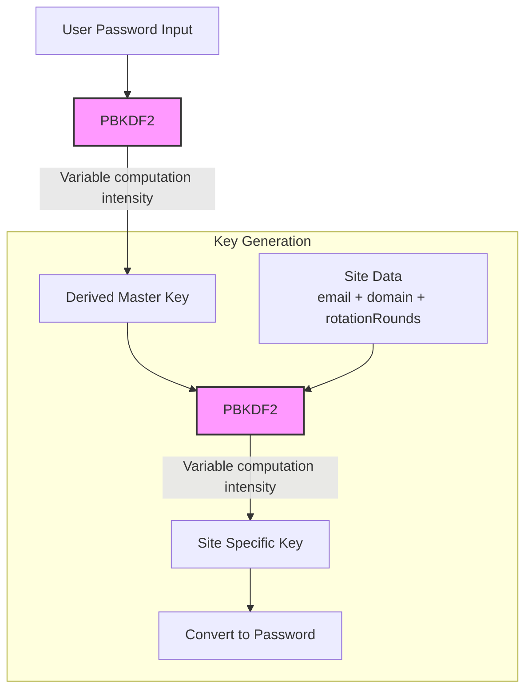

# DeriVault


> Deterministic, offline-first password manager that runs entirely in your browser. Passwords are derived using PBKDF2 and AES-GCM from either a master passphrase or BIP39 mnemonic. No passwords are ever stored; passwords are generated on-demand using cryptographic, secure hash functions.

# Run online

Visit https://khromov.github.io/derivault/

## Password derivation algorithm



## Development

This application is built with SvelteKit, TypeScript, and Tailwind CSS using the shadcn-svelte component library. Install dependencies with `npm install`, then start the development server:

```bash
nvm use # install nvm first
npm i
npm run dev
```

## Building

Create a production version with:

```bash
npm run build
```

## Previewing

Preview the production build with `npm run preview`.

## Security

Cryptographic operations are performed using the Web Crypto API. All password generation happens client-side - no data is ever transmitted to any server. The vault data (domains and usernames) is stored encrypted in localStorage, with the option to export/import using AES-GCM encryption.

## Updating snapshots

```
npm run test:unit -- -u
```

However, keep in mind that the generatePassword tests should not change under any circumstances, as that messes up the password generation!

## License

MIT License
